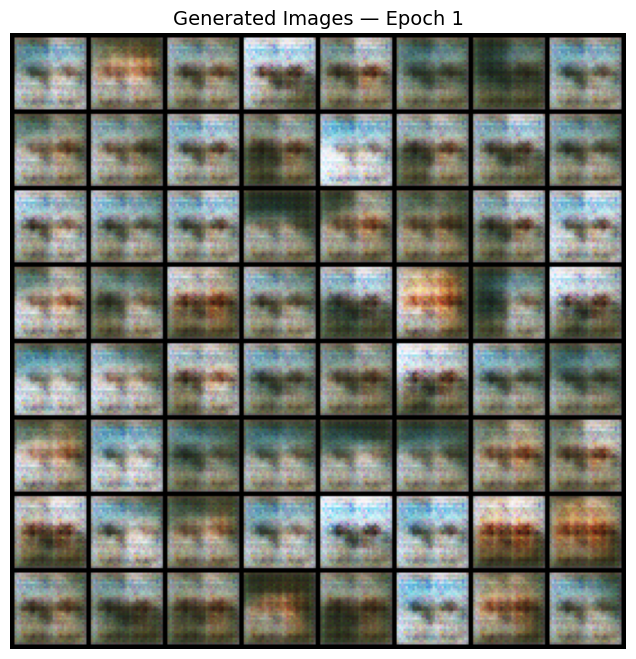
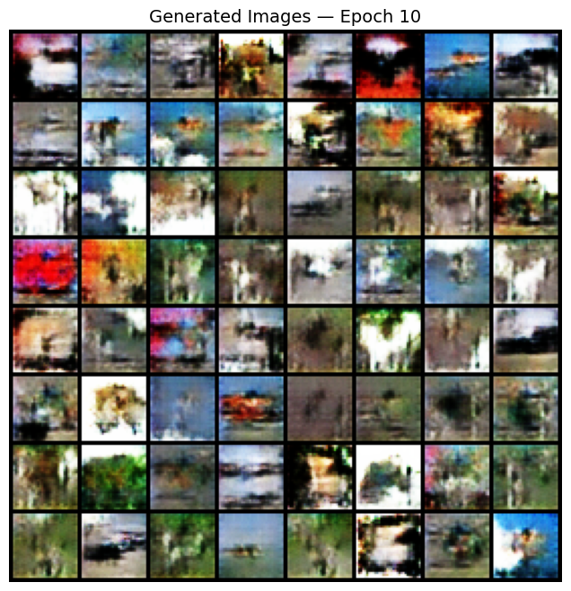
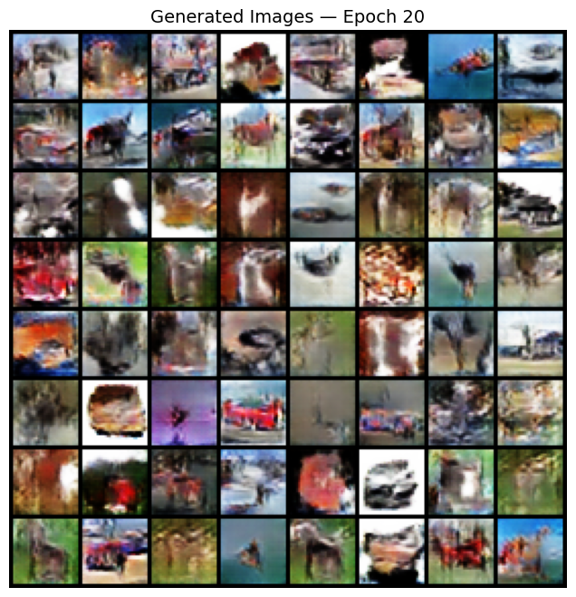
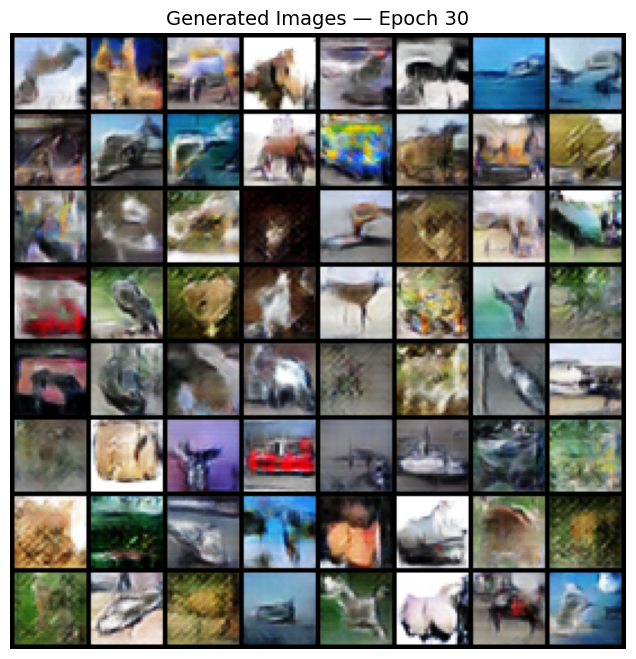
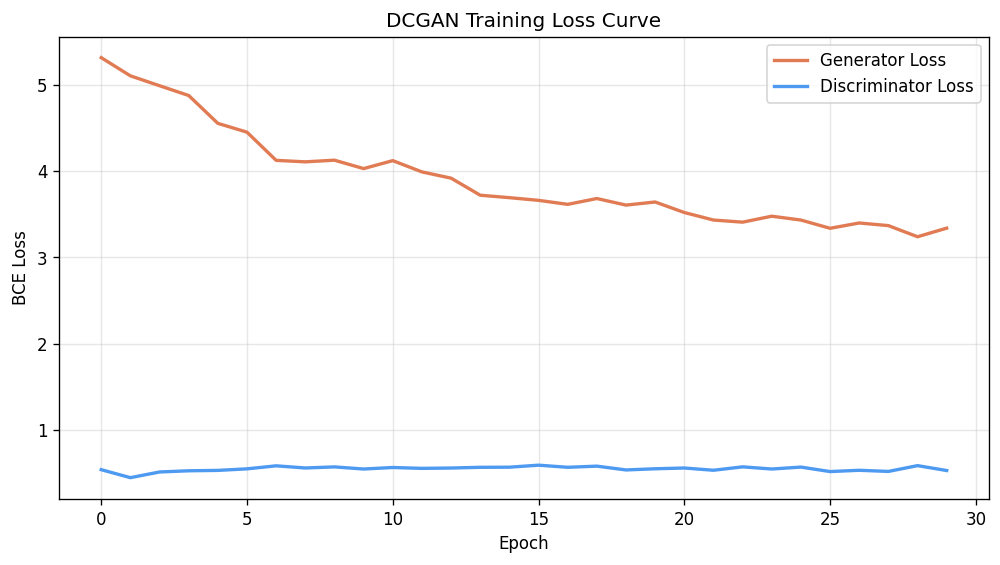

# Generative Image From Noise — DCGAN

A PyTorch implementation of **Deep Convolutional GAN (DCGAN)** trained from scratch to generate realistic images from random noise, using the CIFAR-10 dataset.

Based on [Radford et al. (2015) — Unsupervised Representation Learning with Deep Convolutional Generative Adversarial Networks](https://arxiv.org/abs/1511.06434).

---

## Results

Training progression over 30 epochs on CIFAR-10 (CPU):

| Epoch 1                           | Epoch 10                           | Epoch 20                           | Epoch 30                           |
| --------------------------------- | ---------------------------------- | ---------------------------------- | ---------------------------------- |
|  |  |  |  |

The Generator starts from pure noise and progressively learns colour, texture, and structure. By epoch 30 it produces recognisable animals, vehicles, and objects across CIFAR-10's 10 classes.

---

## How it works

A GAN consists of two neural networks in competition:

**Generator G** — takes a random noise vector `z ∈ R^100` and produces a fake 32×32 RGB image using a series of transposed convolutions that progressively upsample from `1×1` to `32×32`.

**Discriminator D** — takes any image (real or fake) and outputs a probability that it's real. Uses strided convolutions to compress the image down to a single score.

They play a minimax game: G tries to fool D, D tries to catch G. Each network's loss signal drives the other to improve. Over thousands of steps, G learns to produce images that are indistinguishable from real ones.

### Architecture

**Generator**

```
z: (N, 100, 1, 1)
→ ConvTranspose2d → BN → ReLU  →  (N, 512,  2,  2)
→ ConvTranspose2d → BN → ReLU  →  (N, 256,  4,  4)
→ ConvTranspose2d → BN → ReLU  →  (N, 128,  8,  8)
→ ConvTranspose2d → BN → ReLU  →  (N,  64, 16, 16)
→ ConvTranspose2d → Tanh       →  (N,   3, 32, 32)
```

**Discriminator**

```
(N,   3, 32, 32)
→ Conv2d → LeakyReLU            →  (N,  64, 16, 16)
→ Conv2d → BN → LeakyReLU      →  (N, 128,  8,  8)
→ Conv2d → BN → LeakyReLU      →  (N, 256,  4,  4)
→ Conv2d → BN → LeakyReLU      →  (N, 512,  2,  2)
→ Conv2d → Sigmoid              →  (N,   1,  1,  1)
```

### Key design choices

- **LeakyReLU in D, ReLU in G** — prevents dead neurons in the Discriminator, which is the Generator's only source of feedback
- **BatchNorm in both networks** — stabilises training by keeping activations in a consistent range across layers
- **No BatchNorm on first/last layers** — applied per the original paper's recommendation for training stability
- **Weight init from N(0, 0.02)** — small initialisation keeps both networks balanced in the early stages of training
- **Adam with β₁=0.5** — lower than default (0.9) to reduce oscillation during adversarial training
- **Tanh output + normalised real images** — both G output and real images live in [-1, 1], removing an easy signal D could exploit

---

## Training

### Loss curves



Healthy GAN training shows Loss_D hovering around 0.5–0.7 and Loss_G slowly declining. Neither network fully dominates — they stay in competition throughout.

---

## Setup

**Requirements**

```bash
pip install torch torchvision matplotlib numpy
```

**Train from scratch**

```bash
python3 Dcgan_cifar10.py
```

CIFAR-10 (~170MB) downloads automatically on first run.

**Output files**

| Path                            | Contents                                       |
| ------------------------------- | ---------------------------------------------- |
| `data/`                         | CIFAR-10 dataset (auto-downloaded, gitignored) |
| `samples/epoch_NNN.png`         | 8×8 grid of generated images per epoch         |
| `checkpoints/dcgan_epochNNN.pt` | Model weights saved every 5 epochs             |
| `loss_curve.png`                | Generator and Discriminator loss over training |

---

## Potential extensions

- [ ] Add FID score (Fréchet Inception Distance) for quantitative evaluation
- [ ] Implement Conditional GAN — generate specific CIFAR-10 classes on demand
- [ ] Swap dataset to CelebA for face generation
- [ ] Add latent space interpolation — smooth gif morphing between two generated images
- [ ] Try WGAN-GP loss for more stable training and sharper outputs

---

## References

Radford, A., Metz, L., & Chintala, S. (2015). _Unsupervised Representation Learning with Deep Convolutional Generative Adversarial Networks_. arXiv:1511.06434.
